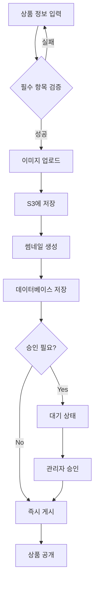

# 상품 등록 및 관리 시스템

## 1. 상품 데이터베이스 설계

### 1.1 Products 테이블

```sql
CREATE TABLE products (
    id BIGINT UNSIGNED PRIMARY KEY AUTO_INCREMENT,

    -- 기본 정보
    name VARCHAR(255) NOT NULL,
    slug VARCHAR(255) UNIQUE NOT NULL,
    sku VARCHAR(100) UNIQUE COMMENT '재고관리코드',
    barcode VARCHAR(50) COMMENT '바코드',

    -- 가격 정보
    price DECIMAL(10, 2) NOT NULL,
    original_price DECIMAL(10, 2) NULL COMMENT '할인 전 가격',
    cost_price DECIMAL(10, 2) NULL COMMENT '원가',

    -- 분류
    category VARCHAR(100) NOT NULL,
    brand VARCHAR(100) DEFAULT 'Dr.Smile',

    -- 상세 정보
    description TEXT COMMENT '상품 설명',
    short_description VARCHAR(500) COMMENT '짧은 설명',
    ingredients TEXT COMMENT '성분 정보',
    efficacy TEXT COMMENT '효능',
    usage_instructions TEXT COMMENT '사용 방법',
    precautions TEXT COMMENT '주의사항',

    -- 사양
    volume VARCHAR(50) COMMENT '용량 (예: 100g)',
    weight DECIMAL(8, 2) COMMENT '무게(g)',
    dimensions JSON COMMENT '크기 (가로x세로x높이)',

    -- 특징 태그
    features JSON COMMENT '["미백", "잇몸케어", "민감치아"]',
    target_audience JSON COMMENT '["성인", "어린이", "노인"]',

    -- 평점 및 리뷰
    rating DECIMAL(3, 2) DEFAULT 0 COMMENT '평균 평점',
    review_count INT DEFAULT 0 COMMENT '리뷰 수',

    -- 재고 관리
    stock INT DEFAULT 0 COMMENT '재고 수량',
    low_stock_threshold INT DEFAULT 10 COMMENT '재고 부족 기준',
    sold_count INT DEFAULT 0 COMMENT '판매 수량',

    -- 이미지
    thumbnail_url VARCHAR(500) COMMENT '썸네일 이미지',
    images JSON COMMENT '상세 이미지 배열',

    -- 상태
    is_active BOOLEAN DEFAULT TRUE COMMENT '판매 중',
    is_featured BOOLEAN DEFAULT FALSE COMMENT '추천 상품',
    is_new BOOLEAN DEFAULT FALSE COMMENT '신상품',
    is_best_seller BOOLEAN DEFAULT FALSE COMMENT '베스트셀러',

    -- 의약외품 정보 (필요 시)
    is_quasi_drug BOOLEAN DEFAULT FALSE COMMENT '의약외품 여부',
    approval_number VARCHAR(100) COMMENT '의약외품 허가번호',
    manufacturer VARCHAR(255) COMMENT '제조사',
    distributor VARCHAR(255) COMMENT '판매원',

    -- SEO
    meta_title VARCHAR(255) COMMENT 'SEO 제목',
    meta_description TEXT COMMENT 'SEO 설명',
    meta_keywords VARCHAR(500) COMMENT 'SEO 키워드',

    -- 타임스탬프
    published_at TIMESTAMP NULL COMMENT '판매 시작일',
    created_at TIMESTAMP NULL,
    updated_at TIMESTAMP NULL,
    deleted_at TIMESTAMP NULL COMMENT 'Soft delete',

    -- 인덱스
    INDEX idx_category (category),
    INDEX idx_rating (rating),
    INDEX idx_price (price),
    INDEX idx_stock (stock),
    INDEX idx_is_active (is_active),
    FULLTEXT INDEX idx_search (name, short_description, description)
);
```

### 1.2 Product Categories 테이블

```sql
CREATE TABLE product_categories (
    id BIGINT UNSIGNED PRIMARY KEY AUTO_INCREMENT,
    name VARCHAR(100) NOT NULL,
    slug VARCHAR(100) UNIQUE NOT NULL,
    description TEXT,
    icon VARCHAR(100) COMMENT 'Icon name or path',
    image_url VARCHAR(500),
    parent_id BIGINT UNSIGNED NULL COMMENT '상위 카테고리',
    sort_order INT DEFAULT 0,
    is_active BOOLEAN DEFAULT TRUE,
    created_at TIMESTAMP NULL,
    updated_at TIMESTAMP NULL,

    FOREIGN KEY (parent_id) REFERENCES product_categories(id) ON DELETE SET NULL,
    INDEX idx_parent (parent_id),
    INDEX idx_sort (sort_order)
);
```

## 2. 카테고리 구조

### 2.1 주요 카테고리

```
전체상품 (All)
├── 미백케어 (Whitening)
│   ├── 강력 미백
│   └── 자연 미백
├── 잇몸케어 (Gum Care)
│   ├── 잇몸 출혈 예방
│   └── 잇몸 건강 강화
├── 민감치아 (Sensitive)
│   ├── 시린이 케어
│   └── 민감성 완화
├── 어린이용 (Kids)
│   ├── 유아용 (0-3세)
│   └── 어린이용 (4-12세)
├── 한방치약 (Herbal)
│   ├── 한약재 배합
│   └── 천연 성분
├── 토탈케어 (Total Care)
│   └── 올인원 케어
└── 선물세트 (Gift Sets)
    ├── 가족 세트
    └── 프리미엄 세트
```

### 2.2 카테고리 시더 데이터

```php
// database/seeders/ProductCategorySeeder.php
$categories = [
    ['name' => '전체상품', 'slug' => 'all', 'sort_order' => 1],
    ['name' => '미백케어', 'slug' => 'whitening', 'sort_order' => 2],
    ['name' => '잇몸케어', 'slug' => 'gum-care', 'sort_order' => 3],
    ['name' => '민감치아', 'slug' => 'sensitive', 'sort_order' => 4],
    ['name' => '어린이용', 'slug' => 'kids', 'sort_order' => 5],
    ['name' => '한방치약', 'slug' => 'herbal', 'sort_order' => 6],
    ['name' => '토탈케어', 'slug' => 'total-care', 'sort_order' => 7],
    ['name' => '선물세트', 'slug' => 'gift-sets', 'sort_order' => 8],
];
```

## 3. 상품 등록 프로세스

### 3.1 관리자 상품 등록 페이지 구성

#### 기본 정보 섹션

-   [x] 상품명 (필수)
-   [x] SKU (재고관리코드)
-   [x] 카테고리 선택 (필수)
-   [x] 브랜드
-   [x] 짧은 설명 (한 줄 소개)

#### 가격 정보 섹션

-   [x] 판매가 (필수)
-   [x] 정상가 (할인 표시용)
-   [x] 원가 (관리용, 비공개)

#### 상세 정보 섹션

-   [x] 상품 상세 설명 (Rich Text Editor)
-   [x] 성분 정보
-   [x] 효능
-   [x] 사용 방법
-   [x] 주의사항

#### 사양 정보 섹션

-   [x] 용량
-   [x] 무게
-   [x] 크기 (가로 x 세로 x 높이)

#### 분류 및 태그 섹션

-   [x] 특징 태그 (다중 선택)
    -   [ ] 미백
    -   [ ] 잇몸케어
    -   [ ] 민감치아
    -   [ ] 구취제거
    -   [ ] 충치예방
    -   [ ] 치석제거
-   [x] 대상 (다중 선택)
    -   [ ] 성인
    -   [ ] 어린이
    -   [ ] 노인
    -   [ ] 임산부

#### 이미지 섹션

-   [x] 썸네일 이미지 (1개, 필수)
-   [x] 상세 이미지 (최대 10개)
-   [x] 이미지 순서 조정 (드래그 앤 드롭)

#### 재고 관리 섹션

-   [x] 현재 재고 수량
-   [x] 재고 부족 알림 기준
-   [x] 재고 추적 활성화 여부

#### 상태 설정 섹션

-   [x] 판매 중 / 판매 중지
-   [x] 추천 상품
-   [x] 신상품
-   [x] 베스트셀러

#### 의약외품 정보 (해당 시)

-   [x] 의약외품 여부
-   [x] 허가번호
-   [x] 제조사
-   [x] 판매원

#### SEO 설정 섹션

-   [x] 메타 제목
-   [x] 메타 설명
-   [x] 메타 키워드

### 3.2 상품 등록 워크플로우



## 4. 이미지 관리

### 4.1 이미지 요구사항

#### 썸네일 이미지

-   **크기**: 800x800px (정사각형)
-   **포맷**: JPG, PNG, WebP
-   **용량**: 최대 2MB
-   **배경**: 흰색 배경 권장

#### 상세 이미지

-   **크기**: 1200x1200px (정사각형) 또는 1200x1600px (세로)
-   **포맷**: JPG, PNG, WebP
-   **용량**: 각 최대 5MB
-   **개수**: 최소 3개, 최대 10개

#### 이미지 가이드라인

-   고해상도 (300dpi 이상)
-   상품이 화면의 80% 차지
-   여러 각도에서 촬영
-   실제 사용 예시 이미지 포함
-   성분 표시 이미지 포함

### 4.2 이미지 처리 파이프라인

```php
// app/Services/ProductImageService.php
class ProductImageService
{
    public function processProductImages(array $images): array
    {
        $processedImages = [];

        foreach ($images as $image) {
            // 1. S3에 원본 업로드
            $originalPath = $this->uploadToS3($image, 'products/original');

            // 2. 썸네일 생성 (800x800)
            $thumbnail = $this->createThumbnail($image, 800, 800);
            $thumbnailPath = $this->uploadToS3($thumbnail, 'products/thumbnails');

            // 3. 중간 크기 생성 (1200x1200)
            $medium = $this->resize($image, 1200, 1200);
            $mediumPath = $this->uploadToS3($medium, 'products/medium');

            // 4. WebP 변환
            $webp = $this->convertToWebP($image);
            $webpPath = $this->uploadToS3($webp, 'products/webp');

            $processedImages[] = [
                'original' => $originalPath,
                'thumbnail' => $thumbnailPath,
                'medium' => $mediumPath,
                'webp' => $webpPath,
            ];
        }

        return $processedImages;
    }
}
```

### 4.3 S3 버킷 구조

```
dr-smile-products/
├── products/
│   ├── original/          # 원본 이미지
│   ├── thumbnails/        # 썸네일 (800x800)
│   ├── medium/            # 중간 크기 (1200x1200)
│   └── webp/              # WebP 포맷
├── categories/            # 카테고리 이미지
└── temp/                  # 임시 업로드
```

## 5. 재고 관리 시스템

### 5.1 재고 추적 테이블

```sql
CREATE TABLE inventory_transactions (
    id BIGINT UNSIGNED PRIMARY KEY AUTO_INCREMENT,
    product_id BIGINT UNSIGNED NOT NULL,
    type ENUM('purchase', 'sale', 'return', 'adjustment') NOT NULL,
    quantity INT NOT NULL COMMENT '양수=입고, 음수=출고',
    stock_before INT NOT NULL COMMENT '변경 전 재고',
    stock_after INT NOT NULL COMMENT '변경 후 재고',
    reference_type VARCHAR(50) COMMENT 'Order, Return, etc.',
    reference_id BIGINT UNSIGNED COMMENT '관련 주문/반품 ID',
    note TEXT,
    created_by BIGINT UNSIGNED COMMENT '작업자',
    created_at TIMESTAMP NULL,

    FOREIGN KEY (product_id) REFERENCES products(id) ON DELETE CASCADE,
    INDEX idx_product_id (product_id),
    INDEX idx_created_at (created_at)
);
```

### 5.2 재고 알림 설정

```php
// app/Services/InventoryService.php
class InventoryService
{
    public function checkLowStock(): void
    {
        $lowStockProducts = Product::where('stock', '<=', DB::raw('low_stock_threshold'))
            ->where('is_active', true)
            ->get();

        foreach ($lowStockProducts as $product) {
            // 관리자에게 알림
            event(new LowStockAlert($product));

            // 자동 주문 처리 (옵션)
            if ($product->auto_reorder) {
                $this->createPurchaseOrder($product);
            }
        }
    }
}
```

### 5.3 재고 관리 기능

-   [ ] 실시간 재고 추적
-   [ ] 재고 부족 알림
-   [ ] 자동 재주문 (옵션)
-   [ ] 재고 이력 조회
-   [ ] 재고 조정 (수동)
-   [ ] 엑셀 일괄 재고 업데이트

## 6. 상품 등록 체크리스트

### 6.1 최소 상품 정보 (필수)

-   [ ] 상품명
-   [ ] 카테고리
-   [ ] 판매가
-   [ ] 썸네일 이미지 (최소 1개)
-   [ ] 짧은 설명
-   [ ] 재고 수량

### 6.2 권장 정보

-   [ ] 상세 설명 (Rich Text)
-   [ ] 성분 정보
-   [ ] 효능 설명
-   [ ] 사용 방법
-   [ ] 상세 이미지 (3개 이상)
-   [ ] 특징 태그
-   [ ] SEO 정보

### 6.3 선택 정보

-   [ ] 할인가 (original_price)
-   [ ] 주의사항
-   [ ] 의약외품 정보
-   [ ] 제조사/판매원 정보
-   [ ] 크기/무게 정보

## 7. 초기 상품 등록 계획

### 7.1 Phase 1: 핵심 제품 (20개)

```
미백케어 (5개)
- Dr.Smile 프리미엄 미백 치약
- Dr.Smile 자연 미백 치약
- Dr.Smile 미백 & 구취 제거
- Dr.Smile 화이트닝 집중 케어
- Dr.Smile 미백 치약 대용량

잇몸케어 (4개)
- Dr.Smile 잇몸 건강 치약
- Dr.Smile 잇몸 출혈 예방
- Dr.Smile 잇몸 강화 치약
- Dr.Smile 잇몸 & 구취 제거

민감치아 (3개)
- Dr.Smile 시린이 케어
- Dr.Smile 민감성 완화
- Dr.Smile 센서티브 프로텍션

어린이용 (3개)
- Dr.Smile 키즈 딸기맛
- Dr.Smile 키즈 포도맛
- Dr.Smile 유아용 치약

토탈케어 (3개)
- Dr.Smile 올인원 케어
- Dr.Smile 프리미엄 토탈
- Dr.Smile 데일리 케어

선물세트 (2개)
- Dr.Smile 프리미엄 세트 (3종)
- Dr.Smile 가족 세트 (4종)
```

### 7.2 Phase 2: 확장 제품 (30개)

-   한방치약 시리즈 (5개)
-   특수 케어 시리즈 (5개)
-   프리미엄 라인 (5개)
-   세트 상품 확대 (5개)
-   시즌 한정판 (10개)

## 8. 구현 우선순위

### Week 1: 데이터베이스 & API

-   [ ] Products 테이블 마이그레이션
-   [ ] Product Categories 테이블 마이그레이션
-   [ ] Inventory Transactions 테이블 마이그레이션
-   [ ] Product CRUD API 구현
-   [ ] 이미지 업로드 API 구현

### Week 2: 관리자 페이지

-   [ ] 상품 목록 페이지
-   [ ] 상품 등록 페이지
-   [ ] 상품 수정 페이지
-   [ ] 이미지 업로드 UI
-   [ ] 재고 관리 페이지

### Week 3: 프론트엔드

-   [ ] 상품 목록 페이지 (고객용)
-   [ ] 상품 상세 페이지
-   [ ] 카테고리 필터링
-   [ ] 검색 기능

### Week 4: 테스트 & 최적화

-   [ ] 이미지 최적화
-   [ ] 페이지 로딩 속도 개선
-   [ ] SEO 최적화
-   [ ] 테스트 데이터 입력

## 9. 관련 문서

-   [배송 시스템 (02_SHIPPING_SYSTEM.md)](02_SHIPPING_SYSTEM.md)
-   [법적 요구사항 (03_LEGAL_REQUIREMENTS.md)](03_LEGAL_REQUIREMENTS.md)
-   [기술 명세서 (SPECIFICATIONS.md)](../SPECIFICATIONS.md)

---

**최종 업데이트**: 2025-11-20
**담당자**: Backend Team
**상태**: Planning → In Progress
