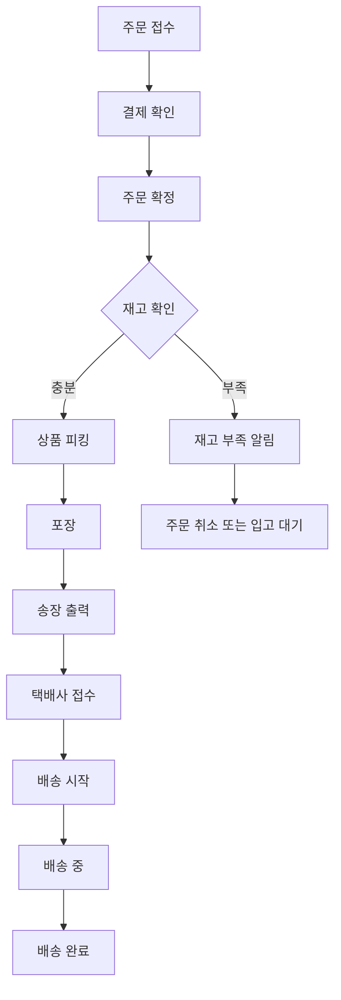

# 배송 시스템 구축

## 1. 택배사 선정 및 계약

### 1.1 주요 택배사 비교

| 택배사         | 장점                | 단점             | 기본 배송비 | API 제공 |
| -------------- | ------------------- | ---------------- | ----------- | -------- |
| **CJ대한통운** | 전국망, 신뢰성 높음 | 단가 높음        | 3,000원~    | ✅       |
| **한진택배**   | 가성비 좋음         | 배송 속도 보통   | 2,500원~    | ✅       |
| **우체국택배** | 도서산간 강점       | 배송 속도 느림   | 2,800원~    | ✅       |
| **로젠택배**   | 단가 저렴           | 서비스 품질 편차 | 2,000원~    | ✅       |
| **쿠팡로켓**   | 당일배송 가능       | 수수료 높음      | 협의        | ❌       |

### 1.2 추천 전략

**초기**: 우체국택배 (안정성 + 합리적 가격)
**성장기**: CJ대한통운 + 한진택배 (물량 분산)
**확장기**: 복수 택배사 계약 (리스크 분산)

### 1.3 계약 체크리스트

-   [ ] 월 예상 물량 협의
-   [ ] 배송비 단가 협상
-   [ ] 반품/교환 프로세스 확인
-   [ ] 보험 가입 여부
-   [ ] API 연동 문서 확인
-   [ ] 송장 출력 방식 협의
-   [ ] 정산 주기 및 방법
-   [ ] 서비스 수준 계약(SLA)

## 2. 배송비 정책 설정

### 2.1 기본 배송비 정책

#### 옵션 1: 조건부 무료배송 (권장 ⭐)

```
기본 배송비: 3,000원
무료배송 기준: 30,000원 이상 구매
도서산간 추가비: 3,000원
제주도 추가비: 5,000원
```

**장점**: 객단가 상승 유도, 고객 만족도 높음
**단점**: 소액 구매 시 수익성 낮음

#### 옵션 2: 전 상품 무료배송

```
기본 배송비: 0원 (상품가에 포함)
도서산간 추가비: 3,000원
제주도 추가비: 5,000원
```

**장점**: 마케팅 포인트, 구매 전환율 높음
**단점**: 마진 감소, 가격 경쟁력 저하

#### 옵션 3: 유료배송

```
기본 배송비: 3,000원
도서산간 추가비: 3,000원
제주도 추가비: 5,000원
```

**장점**: 명확한 원가 구조
**단점**: 고객 이탈 가능성

### 2.2 배송비 데이터베이스 설계

```sql
CREATE TABLE shipping_policies (
    id BIGINT UNSIGNED PRIMARY KEY AUTO_INCREMENT,
    name VARCHAR(100) NOT NULL COMMENT '정책명',
    type ENUM('free', 'fixed', 'conditional') NOT NULL,

    -- 기본 배송비
    base_fee DECIMAL(10, 2) DEFAULT 0,

    -- 조건부 무료배송
    free_shipping_threshold DECIMAL(10, 2) NULL COMMENT '무료배송 기준 금액',

    -- 지역별 추가 배송비
    additional_fees JSON COMMENT '{"jeju": 5000, "island": 3000}',

    -- 적용 범위
    is_default BOOLEAN DEFAULT FALSE,
    applicable_categories JSON COMMENT '적용 카테고리',

    -- 상태
    is_active BOOLEAN DEFAULT TRUE,
    valid_from TIMESTAMP NULL,
    valid_until TIMESTAMP NULL,

    created_at TIMESTAMP NULL,
    updated_at TIMESTAMP NULL,

    INDEX idx_is_default (is_default),
    INDEX idx_is_active (is_active)
);
```

### 2.3 배송비 계산 로직

```php
// app/Services/ShippingCostCalculator.php
class ShippingCostCalculator
{
    public function calculate(Order $order): array
    {
        $policy = $this->getApplicablePolicy($order);
        $baseFee = $policy->base_fee;
        $subtotal = $order->subtotal;

        // 조건부 무료배송 체크
        if ($policy->type === 'conditional'
            && $subtotal >= $policy->free_shipping_threshold) {
            $baseFee = 0;
        }

        // 지역별 추가 배송비
        $additionalFee = $this->getAdditionalFee(
            $order->postal_code,
            $policy->additional_fees
        );

        return [
            'base_fee' => $baseFee,
            'additional_fee' => $additionalFee,
            'total_shipping_cost' => $baseFee + $additionalFee,
            'is_free_shipping' => ($baseFee === 0),
        ];
    }

    private function getAdditionalFee(string $postalCode, array $fees): float
    {
        // 제주도 체크 (우편번호 63000-63644)
        if (preg_match('/^63[0-6]/', $postalCode)) {
            return $fees['jeju'] ?? 5000;
        }

        // 도서산간 체크 (DB에서 조회)
        if ($this->isRemoteArea($postalCode)) {
            return $fees['island'] ?? 3000;
        }

        return 0;
    }
}
```

### 2.4 도서산간 지역 테이블

```sql
CREATE TABLE remote_areas (
    id BIGINT UNSIGNED PRIMARY KEY AUTO_INCREMENT,
    postal_code_start VARCHAR(10) NOT NULL,
    postal_code_end VARCHAR(10) NOT NULL,
    region_name VARCHAR(100) NOT NULL,
    additional_fee DECIMAL(10, 2) DEFAULT 3000,
    delivery_days INT DEFAULT 2 COMMENT '추가 소요일',
    is_active BOOLEAN DEFAULT TRUE,

    INDEX idx_postal_code (postal_code_start, postal_code_end)
);
```

## 3. 송장 출력 및 발송 프로세스

### 3.1 주문 처리 워크플로우



### 3.2 송장 출력 시스템

#### 3.2.1 Shipments 테이블

```sql
CREATE TABLE shipments (
    id BIGINT UNSIGNED PRIMARY KEY AUTO_INCREMENT,
    order_id BIGINT UNSIGNED NOT NULL,

    -- 택배사 정보
    carrier_code VARCHAR(20) NOT NULL COMMENT 'CJ, HANJIN, EPOST 등',
    carrier_name VARCHAR(50) NOT NULL,
    tracking_number VARCHAR(50) NOT NULL COMMENT '송장번호',

    -- 배송 정보
    sender_name VARCHAR(100) NOT NULL,
    sender_phone VARCHAR(20) NOT NULL,
    sender_address TEXT NOT NULL,

    recipient_name VARCHAR(100) NOT NULL,
    recipient_phone VARCHAR(20) NOT NULL,
    recipient_address TEXT NOT NULL,
    recipient_postal_code VARCHAR(10) NOT NULL,

    -- 상품 정보
    product_info TEXT COMMENT '상품명 및 수량',
    total_weight DECIMAL(8, 2) COMMENT '총 무게(kg)',
    box_count INT DEFAULT 1 COMMENT '박스 수',

    -- 배송 지시사항
    delivery_memo TEXT,
    delivery_time_preference VARCHAR(50) COMMENT '배송 희망 시간대',

    -- 배송 상태
    status ENUM('pending', 'picked_up', 'in_transit', 'out_for_delivery', 'delivered', 'failed') DEFAULT 'pending',

    -- 타임스탬프
    shipped_at TIMESTAMP NULL COMMENT '발송일시',
    delivered_at TIMESTAMP NULL COMMENT '배송완료일시',
    created_at TIMESTAMP NULL,
    updated_at TIMESTAMP NULL,

    FOREIGN KEY (order_id) REFERENCES orders(id) ON DELETE CASCADE,
    UNIQUE KEY unique_tracking (carrier_code, tracking_number),
    INDEX idx_order_id (order_id),
    INDEX idx_tracking_number (tracking_number),
    INDEX idx_status (status)
);
```

#### 3.2.2 송장 출력 API 연동

```php
// app/Services/Shipping/ShippingService.php
class ShippingService
{
    public function createShipment(Order $order, string $carrierCode): Shipment
    {
        $carrier = $this->getCarrier($carrierCode);

        // 송장 생성 요청
        $response = $carrier->createWaybill([
            'sender' => $this->getSenderInfo(),
            'recipient' => [
                'name' => $order->recipient_name,
                'phone' => $order->recipient_phone,
                'address' => $order->address,
                'postal_code' => $order->postal_code,
            ],
            'items' => $this->getOrderItems($order),
            'delivery_memo' => $order->delivery_memo,
        ]);

        // Shipment 레코드 생성
        $shipment = Shipment::create([
            'order_id' => $order->id,
            'carrier_code' => $carrierCode,
            'carrier_name' => $carrier->getName(),
            'tracking_number' => $response['tracking_number'],
            'recipient_name' => $order->recipient_name,
            'recipient_phone' => $order->recipient_phone,
            'recipient_address' => $order->address . ' ' . $order->address_detail,
            'recipient_postal_code' => $order->postal_code,
            'product_info' => $this->getProductSummary($order),
            'status' => 'pending',
            'shipped_at' => now(),
        ]);

        // 주문 상태 업데이트
        $order->update(['status' => 'shipping']);

        // 고객에게 발송 알림
        event(new ShipmentCreated($shipment));

        return $shipment;
    }

    public function printLabel(Shipment $shipment): string
    {
        $carrier = $this->getCarrier($shipment->carrier_code);

        // 송장 라벨 PDF 생성
        return $carrier->generateLabel($shipment->tracking_number);
    }
}
```

#### 3.2.3 택배사별 API 래퍼

```php
// app/Services/Shipping/Carriers/CJLogistics.php
class CJLogistics implements CarrierInterface
{
    public function createWaybill(array $data): array
    {
        $response = Http::post('https://apis.cjlogistics.com/waybill/create', [
            'api_key' => config('shipping.cj.api_key'),
            'sender' => $data['sender'],
            'recipient' => $data['recipient'],
            'items' => $data['items'],
        ]);

        return [
            'tracking_number' => $response['waybill_number'],
            'carrier_id' => $response['carrier_id'],
        ];
    }

    public function getTrackingInfo(string $trackingNumber): array
    {
        $response = Http::get("https://apis.cjlogistics.com/tracking/{$trackingNumber}");

        return $response->json();
    }
}
```

### 3.3 송장 출력 템플릿

```php
// resources/views/shipping/label.blade.php
<!DOCTYPE html>
<html>
<head>
    <style>
        @page { size: 10cm 15cm; margin: 0; }
        body { margin: 10mm; font-family: Arial, sans-serif; }
        .label { border: 2px solid #000; padding: 5mm; }
        .barcode { text-align: center; margin: 10px 0; }
        .tracking-number { font-size: 24px; font-weight: bold; text-align: center; }
    </style>
</head>
<body>
    <div class="label">
        <div class="tracking-number">{{ $shipment->tracking_number }}</div>
        <div class="barcode">
            {!! DNS1D::getBarcodeHTML($shipment->tracking_number, 'C128', 2, 50) !!}
        </div>

        <div class="sender">
            <strong>보내는 분:</strong><br>
            {{ $shipment->sender_name }}<br>
            {{ $shipment->sender_phone }}<br>
            {{ $shipment->sender_address }}
        </div>

        <div class="recipient" style="margin-top: 10mm;">
            <strong>받는 분:</strong><br>
            {{ $shipment->recipient_name }}<br>
            {{ $shipment->recipient_phone }}<br>
            [{{ $shipment->recipient_postal_code }}]<br>
            {{ $shipment->recipient_address }}
        </div>

        <div class="product-info" style="margin-top: 5mm;">
            <strong>상품:</strong> {{ $shipment->product_info }}
        </div>

        @if($shipment->delivery_memo)
        <div class="memo" style="margin-top: 5mm;">
            <strong>배송메모:</strong> {{ $shipment->delivery_memo }}
        </div>
        @endif
    </div>
</body>
</html>
```

## 4. 배송 추적 시스템

### 4.1 배송 상태 추적 테이블

```sql
CREATE TABLE shipment_tracking_history (
    id BIGINT UNSIGNED PRIMARY KEY AUTO_INCREMENT,
    shipment_id BIGINT UNSIGNED NOT NULL,
    status VARCHAR(50) NOT NULL,
    location VARCHAR(255) COMMENT '현재 위치',
    description TEXT COMMENT '상태 설명',
    tracked_at TIMESTAMP NOT NULL COMMENT '추적 시간',
    created_at TIMESTAMP NULL,

    FOREIGN KEY (shipment_id) REFERENCES shipments(id) ON DELETE CASCADE,
    INDEX idx_shipment_id (shipment_id),
    INDEX idx_tracked_at (tracked_at)
);
```

### 4.2 배송 추적 API

```php
// app/Http/Controllers/TrackingController.php
class TrackingController extends Controller
{
    public function track(Request $request)
    {
        $trackingNumber = $request->input('tracking_number');
        $shipment = Shipment::where('tracking_number', $trackingNumber)->first();

        if (!$shipment) {
            return response()->json(['error' => 'Tracking number not found'], 404);
        }

        // 택배사 API에서 최신 정보 조회
        $carrier = app(ShippingService::class)->getCarrier($shipment->carrier_code);
        $trackingInfo = $carrier->getTrackingInfo($trackingNumber);

        // 추적 이력 업데이트
        $this->updateTrackingHistory($shipment, $trackingInfo);

        return Inertia::render('Tracking/Show', [
            'shipment' => new ShipmentResource($shipment->fresh()),
            'trackingHistory' => $shipment->trackingHistory,
        ]);
    }
}
```

### 4.3 배송 추적 페이지 (고객용)

```tsx
// resources/js/Pages/Tracking/Show.tsx
export default function TrackingShow({ shipment, trackingHistory }) {
    return (
        <div className="max-w-4xl mx-auto p-6">
            <h1 className="text-2xl font-bold mb-6">배송 조회</h1>

            <div className="bg-white rounded-lg shadow p-6 mb-6">
                <div className="grid grid-cols-2 gap-4">
                    <div>
                        <span className="text-gray-600">송장번호</span>
                        <p className="text-lg font-semibold">
                            {shipment.trackingNumber}
                        </p>
                    </div>
                    <div>
                        <span className="text-gray-600">택배사</span>
                        <p className="text-lg">{shipment.carrierName}</p>
                    </div>
                    <div>
                        <span className="text-gray-600">현재 상태</span>
                        <p className="text-lg">
                            <Badge variant={getStatusVariant(shipment.status)}>
                                {getStatusLabel(shipment.status)}
                            </Badge>
                        </p>
                    </div>
                    <div>
                        <span className="text-gray-600">발송일</span>
                        <p className="text-lg">
                            {formatDate(shipment.shippedAt)}
                        </p>
                    </div>
                </div>
            </div>

            <div className="bg-white rounded-lg shadow p-6">
                <h2 className="text-xl font-semibold mb-4">배송 이력</h2>
                <div className="space-y-4">
                    {trackingHistory.map((history, index) => (
                        <div key={history.id} className="flex items-start">
                            <div className="flex-shrink-0">
                                <div
                                    className={`w-3 h-3 rounded-full ${
                                        index === 0
                                            ? "bg-blue-500"
                                            : "bg-gray-300"
                                    }`}
                                />
                            </div>
                            <div className="ml-4 flex-1">
                                <p className="font-medium">
                                    {history.description}
                                </p>
                                <p className="text-sm text-gray-600">
                                    {history.location}
                                </p>
                                <p className="text-xs text-gray-500">
                                    {formatDateTime(history.trackedAt)}
                                </p>
                            </div>
                        </div>
                    ))}
                </div>
            </div>
        </div>
    );
}
```

### 4.4 자동 배송 상태 업데이트 (크론 작업)

```php
// app/Console/Commands/UpdateShipmentStatus.php
class UpdateShipmentStatus extends Command
{
    protected $signature = 'shipments:update-status';

    public function handle()
    {
        $activeShipments = Shipment::whereIn('status', [
            'pending', 'picked_up', 'in_transit', 'out_for_delivery'
        ])->get();

        foreach ($activeShipments as $shipment) {
            try {
                $carrier = app(ShippingService::class)
                    ->getCarrier($shipment->carrier_code);

                $trackingInfo = $carrier->getTrackingInfo($shipment->tracking_number);

                // 상태 업데이트
                $this->updateShipmentStatus($shipment, $trackingInfo);

            } catch (\Exception $e) {
                Log::error("Failed to update shipment {$shipment->id}: {$e->getMessage()}");
            }
        }

        $this->info('Shipment status updated successfully.');
    }
}
```

```php
// app/Console/Kernel.php
protected function schedule(Schedule $schedule)
{
    // 매 시간마다 배송 상태 업데이트
    $schedule->command('shipments:update-status')->hourly();
}
```

## 5. 배송 관련 알림

### 5.1 알림 종류

-   [ ] 발송 완료 알림 (SMS/이메일)
-   [ ] 배송 중 알림
-   [ ] 배송 완료 알림
-   [ ] 배송 지연 알림

### 5.2 알림 템플릿

```php
// app/Notifications/ShipmentNotification.php
class ShipmentCreatedNotification extends Notification
{
    public function toMail($notifiable)
    {
        return (new MailMessage)
            ->subject('[Dr.Smile] 상품이 발송되었습니다')
            ->greeting("안녕하세요, {$notifiable->name}님!")
            ->line("주문하신 상품이 발송되었습니다.")
            ->line("택배사: {$this->shipment->carrier_name}")
            ->line("송장번호: {$this->shipment->tracking_number}")
            ->action('배송 조회하기', route('tracking.show', $this->shipment->tracking_number))
            ->line('감사합니다!');
    }

    public function toSms($notifiable)
    {
        return "[Dr.Smile] 주문하신 상품이 발송되었습니다. 송장번호: {$this->shipment->tracking_number}";
    }
}
```

## 6. 구현 체크리스트

### Phase 1: 기본 배송 시스템

-   [ ] 배송비 정책 설정
-   [ ] Shipments 테이블 생성
-   [ ] 주문-배송 연결
-   [ ] 기본 배송 상태 관리

### Phase 2: 택배사 연동

-   [ ] 택배사 선정 및 계약
-   [ ] API 연동 (송장 생성)
-   [ ] 송장 출력 기능
-   [ ] 배송 추적 API 연동

### Phase 3: 고급 기능

-   [ ] 자동 배송 상태 업데이트
-   [ ] 고객 배송 추적 페이지
-   [ ] 배송 알림 시스템
-   [ ] 도서산간 지역 관리

### Phase 4: 최적화

-   [ ] 일괄 송장 출력
-   [ ] 배송비 자동 계산
-   [ ] 배송 분석 대시보드
-   [ ] 택배사 성과 모니터링

## 7. 관련 문서

-   [상품 관리 (01_PRODUCT_MANAGEMENT.md)](01_PRODUCT_MANAGEMENT.md)
-   [고객 서비스 (05_CUSTOMER_SERVICE.md)](05_CUSTOMER_SERVICE.md)

---

**최종 업데이트**: 2025-11-20
**담당자**: Operations Team
**상태**: Planning
